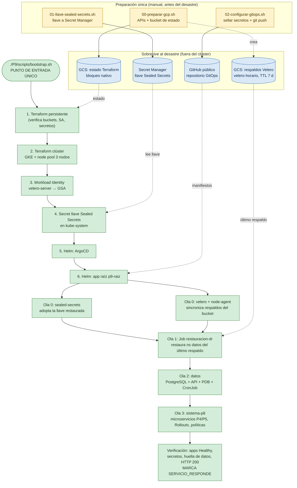

# Diagrama del bootstrap y de la recuperación

Orden de reconstrucción y dependencias. Verde = automático; amarillo = manual (una sola vez, antes de cualquier desastre); azul = persiste fuera del clúster y sobrevive al desastre.

## Por qué este orden

| Dependencia | Motivo |
|---|---|
| Llave (4) antes de ArgoCD (5) | Si el controlador de Sealed Secrets arranca sin llave, genera una nueva y los secretos del repositorio quedan ilegibles. |
| Velero (ola 0) antes de restauración (ola 1) | La restauración necesita los CRDs de Velero y la sincronización de respaldos desde el bucket. |
| Restauración (ola 1) antes de datos (ola 2) | Velero no sobrescribe un PVC existente: si ArgoCD creara primero la base de datos vacía, la restauración se omitiría. |
| Datos (ola 2) antes de P8 (ola 3) | Los microservicios dependen de la base de datos y de los secretos ya descifrados. |
| Salud de `Application` personalizada en ArgoCD | Sin ella las olas no esperan a que la ola anterior esté *Healthy*. |
